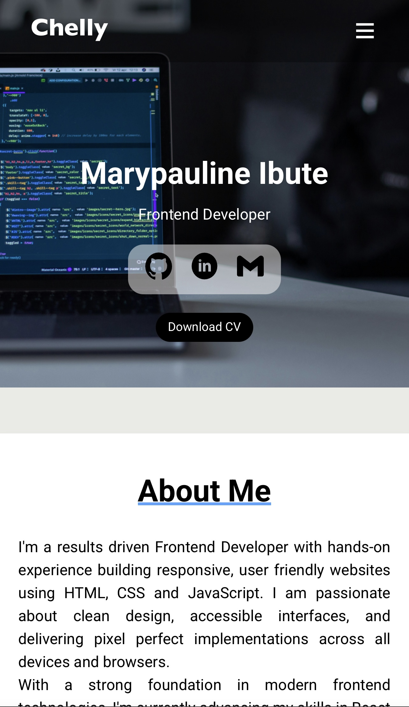

# Personal Portfolio Website 💼

My personal portfolio showcasing my skills, projects, and experience as a Frontend Developer.

## 🔧 Technologies Used
- HTML5
- CSS3
- JavaScript (ES6+)

## 📱 Features
- Responsive design across all devices
- Project showcases with live links
- Smooth scrolling and UI transitions
- Contact form integration (FormSubmit)

## 📷 Preview
🔗 [Live Site](https://chellyy01.github.io/My-Portfolio/)

## 📂 How to Use
1. Explore my projects and contact me through the form!

## 🙋‍♀️ Author
Marypauline Ibute  
GitHub: 🔗 [Chellyy01](https://github.com/Chellyy01)
LinkedIn: [Marypauline Ibute](https://www.linkedin.com/in/marypaulineibute/)
